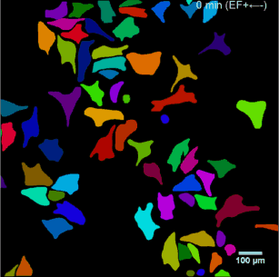

# Mặt nạ R-CNN để phát hiện và phân đoạn đối tượng

Đây là cách triển khai [Mask R-CNN](https://arxiv.org/abs/1703.06870) trên Python 3, Keras và TensorFlow. Mô hình tạo các hộp giới hạn và mặt nạ phân đoạn cho từng phiên bản của một đối tượng trong ảnh. Nó dựa trên Mạng kim tự tháp tính năng (FPN) và xương sống ResNet101.


Kho lưu trữ bao gồm:
* Mã nguồn của Mặt nạ R-CNN được xây dựng trên FPN và ResNet101.
* Mã đào tạo cho MS COCO
* Trọng lượng được đào tạo trước cho MS COCO
* Sổ ghi chép Jupyter để trực quan hóa quy trình phát hiện ở mọi bước
* Lớp ParallelModel để đào tạo đa GPU
* Đánh giá về số liệu MS COCO (AP)
* Ví dụ về đào tạo trên tập dữ liệu của riêng bạn


Mã được ghi lại và được thiết kế để dễ dàng mở rộng. Nếu bạn sử dụng nó trong nghiên cứu của mình, vui lòng xem xét việc trích dẫn kho lưu trữ này (bibtex bên dưới). Nếu làm việc với hình ảnh 3D, thì bạn cũng có thể thấy tập dữ liệu [Matterport3D](https://matterport.com/blog/2017/09/20/anninating-matterport3d-research-dataset/) mới phát hành của chúng tôi cũng hữu ích.
Tập dữ liệu này được tạo từ các không gian được tái tạo 3D do khách hàng của chúng tôi chụp lại, những người đã đồng ý cung cấp chúng công khai cho mục đích học thuật. Bạn có thể xem thêm ví dụ [tại đây](https://matterport.com/gallery/).

# Bắt đầu
* [demo.ipynb](samples/demo.ipynb) Là cách dễ nhất để bắt đầu. Nó cho thấy một ví dụ về việc sử dụng một mô hình được đào tạo trước trên MS COCO để phân đoạn các đối tượng trong hình ảnh của riêng bạn.
Nó bao gồm mã để chạy phát hiện đối tượng và phân đoạn đối tượng trên các hình ảnh tùy ý.

* [train_shapes.ipynb](samples/shapes/train_shapes.ipynb) cho biết cách đào tạo Mặt nạ R-CNN trên tập dữ liệu của riêng bạn. Sổ ghi chép này giới thiệu tập dữ liệu đồ chơi (Hình dạng) để minh họa quá trình đào tạo trên tập dữ liệu mới.

* ([model.py](mrcnn/model.py), [utils.py](mrcnn/utils.py), [config.py](mrcnn/config.py)): Các tệp này chứa triển khai RCNN Mặt nạ chính .


* [inspect_data.ipynb](samples/coco/inspect_data.ipynb). Sổ tay này trực quan hóa các bước tiền xử lý khác nhau
để chuẩn bị dữ liệu huấn luyện.

* [inspect_model.ipynb](samples/coco/inspect_model.ipynb) Sổ tay này đi sâu vào các bước được thực hiện để phát hiện và phân đoạn đối tượng. Nó cung cấp trực quan hóa từng bước của quy trình.

* [inspect_weights.ipynb](samples/coco/inspect_weights.ipynb)
Sổ tay này kiểm tra các trọng số của một mô hình được đào tạo và tìm kiếm các điểm bất thường và các mẫu kỳ lạ.


# Từng bước phát hiện
Để giúp gỡ lỗi và hiểu mô hình, có 3 cuốn sổ tay
([inspect_data.ipynb](samples/coco/inspect_data.ipynb), [inspect_model.ipynb](samples/coco/inspect_model.ipynb),
[inspect_weights.ipynb](samples/coco/inspect_weights.ipynb)) cung cấp nhiều hình ảnh trực quan và cho phép chạy mô hình từng bước để kiểm tra đầu ra tại mỗi điểm. Dưới đây là một vài ví dụ:


## 1. Phân loại và lọc neo
Trực quan hóa mọi bước của Mạng đề xuất khu vực giai đoạn đầu tiên và hiển thị các neo tích cực và tiêu cực cùng với việc sàng lọc hộp neo.


## 2. Tinh chỉnh hộp giới hạn
Đây là một ví dụ về hộp phát hiện cuối cùng (đường chấm chấm) và tinh chỉnh được áp dụng cho chúng (đường liền nét) trong giai đoạn thứ hai.


## 3. Tạo mặt nạ
Ví dụ về mặt nạ được tạo. Những thứ này sau đó được thu nhỏ và đặt trên hình ảnh ở đúng vị trí.


## 4. Kích hoạt lớp
Thông thường, việc kiểm tra kích hoạt ở các lớp khác nhau sẽ rất hữu ích để tìm kiếm các dấu hiệu của sự cố (tất cả các số 0 hoặc nhiễu ngẫu nhiên).


## 5. Biểu đồ cân nặng
Một công cụ sửa lỗi hữu ích khác là kiểm tra biểu đồ trọng lượng. Chúng được bao gồm trong sổ ghi chép examine_weights.ipynb.


## 6. Đăng nhập vào TensorBoard
TensorBoard là một công cụ trực quan hóa và sửa lỗi tuyệt vời khác. Mô hình được định cấu hình để ghi nhật ký tổn thất và lưu trọng số vào cuối mỗi kỷ nguyên.


## 6. Kết hợp các phần khác nhau thành kết quả cuối cùng


# Đào tạo về MS COCO
Chúng tôi đang cung cấp trọng lượng được đào tạo trước cho MS COCO để bắt đầu dễ dàng hơn. Bạn có thể
sử dụng các trọng số đó làm điểm bắt đầu để huấn luyện biến thể của riêng bạn trên mạng.
Mã đào tạo và đánh giá nằm trong `samples/coco/coco.py`. Bạn có thể nhập cái này
mô-đun trong sổ ghi chép Jupyter (xem ví dụ về sổ ghi chép được cung cấp) hoặc bạn
có thể chạy nó trực tiếp từ dòng lệnh như vậy:

```
# Đào tạo một mô hình mới bắt đầu từ trọng lượng COCO được đào tạo trước
mẫu python3/coco/coco.py train --dataset=/path/to/coco/ --model=coco

# Huấn luyện một mô hình mới bắt đầu từ các trọng số ImageNet
mẫu python3/coco/coco.py train --dataset=/path/to/coco/ --model=imagenet

# Tiếp tục đào tạo một mô hình mà bạn đã đào tạo trước đó
mẫu python3/coco/coco.py train --dataset=/path/to/coco/ --model=/path/to/weights.h5

# Tiếp tục đào tạo mô hình cuối cùng mà bạn đã đào tạo. Điều này sẽ tìm thấy
# trọng số được đào tạo cuối cùng trong thư mục mô hình.
mẫu python3/coco/coco.py train --dataset=/path/to/coco/ --model=last
```

Bạn cũng có thể chạy mã đánh giá COCO với:
```
# Chạy đánh giá COCO trên mô hình được đào tạo cuối cùng
mẫu python3/coco/coco.py đánh giá --dataset=/path/to/coco/ --model=last
```

Lịch trình đào tạo, tỷ lệ học tập và các tham số khác phải được đặt trong `samples/coco/coco.py`.


# Đào tạo trên tập dữ liệu của riêng bạn

Bắt đầu bằng cách đọc [bài đăng trên blog về mẫu giật gân màu bong bóng](https://engineering.matterport.com/splash-of-color-instance-segmentation-with-mask-r-cnn-and-tensorflow-7c761e238b46) này. Nó bao gồm quá trình bắt đầu từ chú thích hình ảnh để đào tạo để sử dụng các kết quả trong một ứng dụng mẫu.

Tóm lại, để đào tạo mô hình trên tập dữ liệu của riêng bạn, bạn sẽ cần mở rộng hai lớp:

```Cấu hình```
Lớp này chứa cấu hình mặc định. Phân lớp nó và sửa đổi các thuộc tính bạn cần thay đổi.

```Bộ dữ liệu```
Lớp này cung cấp một cách nhất quán để làm việc với bất kỳ tập dữ liệu nào.
Nó cho phép bạn sử dụng bộ dữ liệu mới để đào tạo mà không phải thay đổi
mã của mô hình. Nó cũng hỗ trợ tải nhiều bộ dữ liệu tại
đồng thời, điều này rất hữu ích nếu các đối tượng bạn muốn phát hiện không
tất cả có sẵn trong một bộ dữ liệu.

Xem các ví dụ trong `samples/shapes/train_shapes.ipynb`, `samples/coco/coco.py`, `samples/balloon/balloon.py` và `samples/nucleus/nucleus.py`.

## Sự khác biệt so với Tài liệu chính thức
Phần triển khai này tuân theo phần lớn bài viết về Mặt nạ RCNN, nhưng có một vài trường hợp chúng tôi đi chệch hướng theo hướng đơn giản hóa và khái quát hóa mã. Đây là một số khác biệt mà chúng tôi biết. Nếu bạn gặp phải sự khác biệt khác, xin vui lòng cho chúng tôi biết.

* **Thay đổi kích thước hình ảnh:** Để hỗ trợ đào tạo nhiều hình ảnh mỗi lô, chúng tôi thay đổi kích thước tất cả các hình ảnh thành cùng một kích thước. Ví dụ: 1024x1024px trên MS COCO. Chúng tôi giữ nguyên tỷ lệ khung hình, vì vậy nếu một hình ảnh không phải là hình vuông, chúng tôi sẽ thêm các số 0 vào hình ảnh đó. Trong bài báo, việc thay đổi kích thước được thực hiện sao cho cạnh nhỏ nhất là 800px và cạnh lớn nhất được cắt ở 1000px.
* **Hộp giới hạn**: Một số bộ dữ liệu cung cấp hộp giới hạn và một số chỉ cung cấp mặt nạ. Để hỗ trợ đào tạo trên nhiều tập dữ liệu, chúng tôi đã chọn bỏ qua các hộp giới hạn đi kèm với tập dữ liệu và thay vào đó tạo chúng một cách nhanh chóng. Chúng tôi chọn hộp nhỏ nhất gói gọn tất cả các pixel của mặt nạ làm hộp giới hạn. Điều này đơn giản hóa việc triển khai và cũng giúp dễ dàng áp dụng các phần mở rộng hình ảnh mà nếu không sẽ khó áp dụng cho các hộp giới hạn, chẳng hạn như xoay hình ảnh.

     Để xác thực phương pháp này, chúng tôi đã so sánh các hộp giới hạn được tính toán của mình với các hộp được cung cấp bởi bộ dữ liệu COCO.
Chúng tôi nhận thấy rằng ~2% hộp giới hạn chênh lệch từ 1px trở lên, ~0,05% chênh lệch từ 5px trở lên,
và chỉ 0,01% khác nhau từ 10px trở lên.

* **Tốc độ học tập:** Bài báo sử dụng tốc độ học tập là 0,02, nhưng chúng tôi nhận thấy rằng
quá cao và thường gây nổ quả cân, đặc biệt là khi sử dụng một lô nhỏ
kích cỡ. Nó có thể liên quan đến sự khác biệt giữa cách Caffe và TensorFlow tính toán
độ dốc (tổng so với trung bình giữa các đợt và GPU). Hoặc, có thể mô hình chính thức sử dụng gradient
clipping để tránh vấn đề này. Chúng tôi sử dụng tính năng cắt độ dốc, nhưng không đặt nó quá mạnh.
Dù sao thì chúng tôi thấy rằng tốc độ học tập nhỏ hơn hội tụ nhanh hơn nên chúng tôi chấp nhận điều đó.

## Trích dẫn
Sử dụng bibtex này để trích dẫn kho lưu trữ này:
```
@misc{matterport_maskrcnn_2017,
   title={Mặt nạ R-CNN để phát hiện đối tượng và phân đoạn đối tượng trên Keras và TensorFlow},
   tác giả={Waleed Abdulla},
   năm={2017},
   nhà xuất bản={Github},
   tạp chí={Kho lưu trữ GitHub},
   howpublished={\url{https://github.com/matterport/Mask_RCNN}},
}
```

## Đóng góp
Đóng góp cho kho lưu trữ này được hoan nghênh. Ví dụ về những điều bạn có thể đóng góp:
* Cải thiện tốc độ. Giống như viết lại một số mã Python trong TensorFlow hoặc Cython.
* Đào tạo trên các bộ dữ liệu khác.
* Cải thiện độ chính xác.
* Trực quan hóa và ví dụ.

Bạn cũng có thể [tham gia nhóm của chúng tôi](https://matterport.com/careers/) và giúp chúng tôi xây dựng nhiều dự án như thế này hơn nữa.

## Yêu cầu
Python 3.4, TensorFlow 1.3, Keras 2.0.8 và các gói phổ biến khác được liệt kê trong `requirements.txt`.

### MS COCO Yêu cầu:
Để đào tạo hoặc kiểm tra trên MS COCO, bạn cũng sẽ cần:
* pycocotools (hướng dẫn cài đặt bên dưới)
* [Bộ dữ liệu MS COCO](http://cocodataset.org/#home)
* Tải xuống 5K [tối thiểu](https://dl.dropboxusercontent.com/s/o43o90bna78omob/instances_minival2014.json.zip?dl=0)
   và 35K [xác thực-trừ-tối thiểu](https://dl.dropboxusercontent.com/s/s3tw5zcg7395368/instances_valminusminival2014.json.zip?dl=0)
   tập hợp con. Thông tin chi tiết khác trong bản gốc [Triển khai R-CNN nhanh hơn](https://github.com/rbgirshick/py-faster-rcnn/blob/master/data/README.md).

Nếu bạn sử dụng Docker, mã đã được xác minh để hoạt động trên
[bộ chứa Docker này](https://hub.docker.com/r/waleedka/modern-deep-learning/).


## Cài đặt
1. Sao chép kho lưu trữ này
2. Cài đặt phụ thuộc
    ```bash
    cài đặt pip3 -r tests.txt
    ```
3. Chạy thiết lập từ thư mục gốc của kho lưu trữ
     ```bash
     python3 setup.py cài đặt
     ```
3. Tải xuống các trọng số COCO được đào tạo trước (mask_rcnn_coco.h5) từ [trang phát hành](https://github.com/matterport/Mask_RCNN/releases).
4. (Tùy chọn) Để đào tạo hoặc kiểm tra trên MS COCO, hãy cài đặt `pycocotools` từ một trong các kho lưu trữ này. Chúng là nhánh của pycocotools ban đầu với các bản sửa lỗi cho Python3 và Windows (repo chính thức dường như không còn hoạt động nữa).

     * Linux: https://github.com/waleedka/coco
     * Cửa sổ: https://github.com/philferriere/cocoapi.
     Bạn phải có các công cụ xây dựng Visual C++ 2015 trên đường dẫn của mình (xem repo để biết thêm chi tiết)

# Dự án Sử dụng Mô hình này
Nếu bạn mở rộng mô hình này sang các bộ dữ liệu khác hoặc xây dựng các dự án sử dụng nó, thì chúng tôi rất mong nhận được phản hồi từ bạn.

### [Video demo 4K](https://www.youtube.com/watch?v=OOT3UIXZztE) của Karol Majek.
[](https://www.youtube.com/watch?v=OOT3UIXZztE)

### [Hình ảnh tới OSM](https://github.com/jremillard/images-to-osm): Cải thiện OpenStreetMap bằng cách thêm các sân bóng chày, bóng đá, quần vợt, bóng bầu dục và bóng rổ.


### [Sắc màu giật gân](https://engineering.matterport.com/splash-of-color-instance-segmentation-with-mask-r-cnn-and-tensorflow-7c761e238b46). Một bài đăng trên blog giải thích cách đào tạo mô hình này từ đầu và sử dụng nó để triển khai hiệu ứng giật gân màu.


### [Phân đoạn hạt nhân trong ảnh hiển vi](mẫu/hạt nhân). Được xây dựng cho [Bát khoa học dữ liệu 2018](https://www.kaggle.com/c/data-science-bowl-2018)
Mã nằm trong thư mục `samples/nucleus`.


### [Phát hiện và phân đoạn cho rô-bốt phẫu thuật](https://github.com/SUYEgit/Surgery-Robot-Detection-Segmentation) của Phòng thí nghiệm điều khiển và cơ điện tử NUS.


### [Tái tạo tòa nhà 3D từ LiDAR trên không](https://medium.com/geoai/reconstructing-3d-buildings-from-aerial-lidar-with-ai-details-6a81cb3079c0)
Dự án bằng chứng về khái niệm của [Esri](https://www.esri.com/), phối hợp với Nvidia và Hạt Miami-Dade. Cùng với bài viết và mã tuyệt vời của Dmitry Kudinov, Daniel Hedges và Omar Maher.


### [Usiigaci: Theo dõi tế bào không nhãn trong kính hiển vi tương phản pha](https://github.com/oist/usiigaci)
Một dự án từ Nhật Bản để tự động theo dõi các tế bào trong nền tảng vi lỏng. Giấy đang chờ xử lý nhưng mã nguồn đã được phát hành.

 

### [Đặc điểm của các đa giác nêm băng ở Bắc Cực trong hình ảnh chụp từ trên không có độ phân giải không gian rất cao](http://www.mdpi.com/2072-4292/10/9/1487)
Dự án nghiên cứu để hiểu các quá trình phức tạp giữa suy thoái ở Bắc Cực và biến đổi khí hậu. Bởi Weixing Zhang, Chandi Witharana, Anna Liljedahl và Mikhail Kanevskiy.


### [Mặt nạ-RCNN Sáng bóng](https://github.com/huuuuusy/Mask-RCNN-Shiny)
Một dự án lớp thị giác máy tính của HU Shiyu để áp dụng hiệu ứng pop màu lên người với kết quả đẹp mắt.


### [Thử thách lập bản đồ](https://github.com/crowdAI/crowdai-mapping-challenge-mask-rcnn): Chuyển đổi hình ảnh vệ tinh thành bản đồ để các tổ chức nhân đạo sử dụng.


### [Addon GRASS GIS](https://github.com/ctu-geoforall-lab/i.ann.maskrcnn) để tạo mặt nạ vectơ từ hình ảnh không gian địa lý. Dựa trên [Luận văn thạc sĩ](https://github.com/ctu-geoforall-lab-projects/dp-pesek-2018) của Ondřej Pešek.

